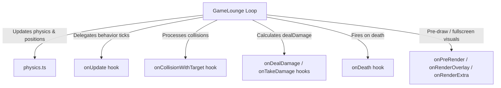

# Project Architecture (AI Harness Document)

This document provides a high-level description of the system architecture for the `dambae-ballgame` workspace. Use it to understand the responsibilities of each module without reading the source code.

## Core Modules
- `src/main.ts` — Game UI initializer, event listeners, menu transitions, and DOM controls.
- `src/characterManager.ts` — Registers `availableCharacters` list and maps configuration configurations to active game state instances (`createCharacterState`).
- `src/maingame/physics.ts` — Specialized math functions for collision resolutions, boundary bounding, and friction limit speeds.
- `src/maps/` — Arena definitions. Each map owns its dimensions and visual defaults independently.
  - `soloLargeArena.ts` — Expanded arena automatically used for 4–6 player free-for-all matches.
  - `teamArenas.ts` — Deathmatch, control, and royal-guard arena definitions.
- `src/characters/<character-name>/normal.ts` — Normal playable character implementation.
- `src/characters/<boss-name>/boss.ts` — Independently authored boss implementation; bosses are never runtime-scaled normal characters.

## Main Engine: `GameLounge` (`src/maingame/gameLounge.ts`)
`GameLounge` is a lightweight game engine that runs the main execution loop (physics updates and main canvas rendering). 

### Clean Sandbox Rule
Specific character behaviors and formulas are strictly decoupled from `GameLounge`. It manages all physics interactions generically and delegates unique operations to character configuration hooks.

## Character Lifecycle Hooks
All characters must implement the `CharacterConfig` interface (`src/characters/character.interface.ts`). The engine fires the following hooks:

1. **`onSkillTrigger(char, ctx)`** — Called once when the character's skill gauge reaches 100%. Sets up initial skill state.
2. **`onUpdate(char, dt, ctx)`** — Executed on every frame tick (60FPS). Processes state durations, cooldowns, and custom movements.
3. **`onCollisionWithTarget(char, opponent, ctx)`** — Fires when this character collides with another character.
4. **`onBasicAttack(char, opponent, ctx)`** — Fires when this character performs a basic auto-attack.
5. **`onTakeDamage(target, attacker, damage, ctx)`** — Defensive modifier. Resolves shields, immunity, swap passives, and damage reduction. Returns `{ finalDamage, blocked }`.
6. **`onDealDamage(attacker, target, damage, ctx)`** — Offensive modifier. Resolves outgoing damage multipliers. Returns modified damage amount.
7. **`onDeath(char, killer, ctx)`** — Cleanup hook executed when this character dies (e.g. releasing summons or debuffs).
8. **`onPreRender(char, canvasCtx)`** — Run before drawing the character body. Modifies drawing states like opacity, scale, and background shadows.
9. **`onRenderExtra(char, canvasCtx, currentRadius)`** — Run after drawing the character body. Used to draw sub-entities, health plates, and local visual gauges.
10. **`onRenderOverlay(char, canvasCtx, width, height)`** — Run at the end of the rendering loop. Used to draw screen-wide overlays, shake translations, and subtitle subtitles.
11. **`isTargetable(char)`** — Exclude this character from auto-attack targeting list (returns `boolean`).
